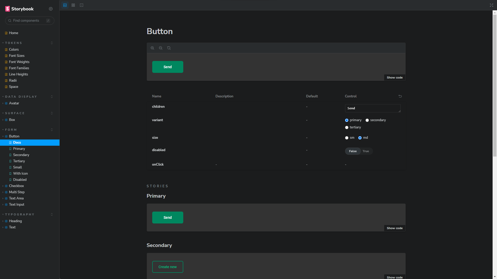

<h1 align="center"> LuPeBreak UI - Design System </h1>

  Voce pode encontrar demo do projeto no github pages nesse <a href="https://lupebreak.github.io/design-system">Link</a>

  <a href="#-tecnologias">Tecnologias</a>&nbsp;&nbsp;&nbsp;|&nbsp;&nbsp;&nbsp;
  <a href="#-projeto">Projeto</a>&nbsp;&nbsp;&nbsp;|&nbsp;&nbsp;&nbsp;
  <a href="#-Components">Components</a>&nbsp;&nbsp;&nbsp;|&nbsp;&nbsp;&nbsp;
  <a href="#memo-licença">Licença</a>

 

  

## 🚀 Tecnologias

Esse projeto foi desenvolvido com as seguintes tecnologias:

- Javascript
- Typescript
- React
- Storybook
- Stitches
- Eslint
- Git e Github

## Components

- [x] Text
- [x] Heading
- [x] Box
- [x] Button
- [x] TextInput
- [x] TextArea
- [x] Checkbox
- [x] Avatar
- [x] MultiStep

## Pacotes Públicos

- [x] Tokens do Design System
- [x] Componentes React
- [x] Documentação com Storybook

## 💻 Projeto

Esse é um pequeno projeto de um Design System feito durante os estudos do modulo de Design System do Ignite React da Rocketseat

Fique a vontade para reutilizar o projeto.

---

Feito com ♥ by [LuPeBreak](https://github.com/LuPeBreak/)!
